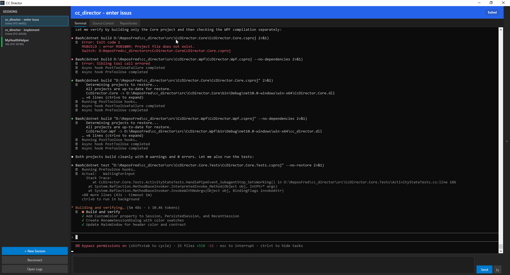

# CC Director

A Windows desktop application for managing multiple [Claude Code](https://docs.anthropic.com/en/docs/claude-code) sessions simultaneously. Run, monitor, and switch between independent Claude Code instances — each working on its own repository — from a single unified interface.



## Features

### Multi-Session Management
- Run multiple Claude Code sessions side-by-side, each in its own embedded console
- Switch between sessions instantly from the sidebar
- Drag-and-drop to reorder sessions
- Name and color-code sessions for easy identification
- Right-click context menu: Rename, Open in Explorer, Open in VS Code, Close

### Embedded Console
- Claude Code runs in a native Windows console window overlaid directly onto the WPF application
- Full interactive terminal — no emulation, no limitations
- Send prompts from a dedicated input bar at the bottom (Ctrl+Enter to submit)

### Real-Time Activity Tracking
- Monitors each session's state in real-time: **Idle**, **Working**, **Waiting for Input**, **Waiting for Permission**, **Exited**
- Color-coded status indicators on each session in the sidebar
- Powered by Claude Code's hook system — every tool call, prompt, and notification is captured

### Session Persistence
- Sessions survive app restarts — CC Director reconnects to running Claude processes on launch
- "Reconnect" button scans for orphaned `claude.exe` processes and reclaims them
- Recent sessions are remembered with their custom names and colors

### Git Integration
- **Source Control tab** shows staged and unstaged changes for the active session's repository
- File tree with status indicators (Modified, Added, Deleted, Renamed, etc.)
- Current branch display with ahead/behind sync status
- Click a file to open it in VS Code

### Repository Management
- **Repositories tab** for registering, cloning, and initializing Git repositories
- Clone from URL or browse your GitHub repos
- Quick-launch a new session from any registered repository

### Hook Integration
- Automatically installs hooks into Claude Code's `~/.claude/settings.json`
- Captures 14 hook event types: session start/end, tool use, notifications, subagent activity, task completion, and more
- Named pipe IPC (`CC_ClaudeDirector`) for fast, async event delivery
- Optional pipe message log panel (toggle from sidebar) for debugging and observability

### Logging & Diagnostics
- File logging to `%LOCALAPPDATA%\CcDirector\logs\`
- "Open Logs" button in the sidebar for quick access

## Architecture

```
CcDirector.sln
├── CcDirector.Core        # Session management, hooks, pipes, git, config (no UI dependencies)
├── CcDirector.Wpf         # WPF desktop application
└── CcDirector.Core.Tests  # xUnit test suite
```

**How it works:**

1. CC Director spawns `claude.exe` in native console windows and overlays them onto the WPF UI
2. A PowerShell relay script is installed as a Claude Code hook — it forwards hook events (JSON) over a Windows named pipe
3. A pipe server inside CC Director receives events, routes them to the correct session, and updates the activity state
4. The WPF UI reflects state changes in real-time via data binding

```
Claude Code ──hook──▶ PowerShell relay ──named pipe──▶ CC Director
                                                          │
                                              ┌───────────┴───────────┐
                                          EventRouter          Session UI
                                        (maps session_id)    (activity colors,
                                                               status badges)
```

## Requirements

- Windows 10/11
- .NET 10 SDK (or later)
- [Claude Code CLI](https://docs.anthropic.com/en/docs/claude-code) installed and available on PATH
- **Windows Console Host** as default terminal (not Windows Terminal — a warning dialog will guide you if needed)

## Building

```bash
dotnet build src/CcDirector.Wpf/CcDirector.Wpf.csproj
```

## Running

```bash
dotnet run --project src/CcDirector.Wpf/CcDirector.Wpf.csproj
```

Or open `CcDirector.sln` in Visual Studio and run the `CcDirector.Wpf` project.

## Running Tests

```bash
dotnet test src/CcDirector.Core.Tests/CcDirector.Core.Tests.csproj
```

## Configuration

Edit `src/CcDirector.Wpf/appsettings.json` to configure:

- **ClaudePath** — path to the `claude` executable (default: `"claude"`)
- **DefaultClaudeArgs** — CLI arguments passed to each session (default: `"--dangerously-skip-permissions"`)
- **Repositories** — seed list of repository paths to register on first launch

Session state and repository registry are persisted in `~/Documents/CcDirector/`.

## License

MIT
