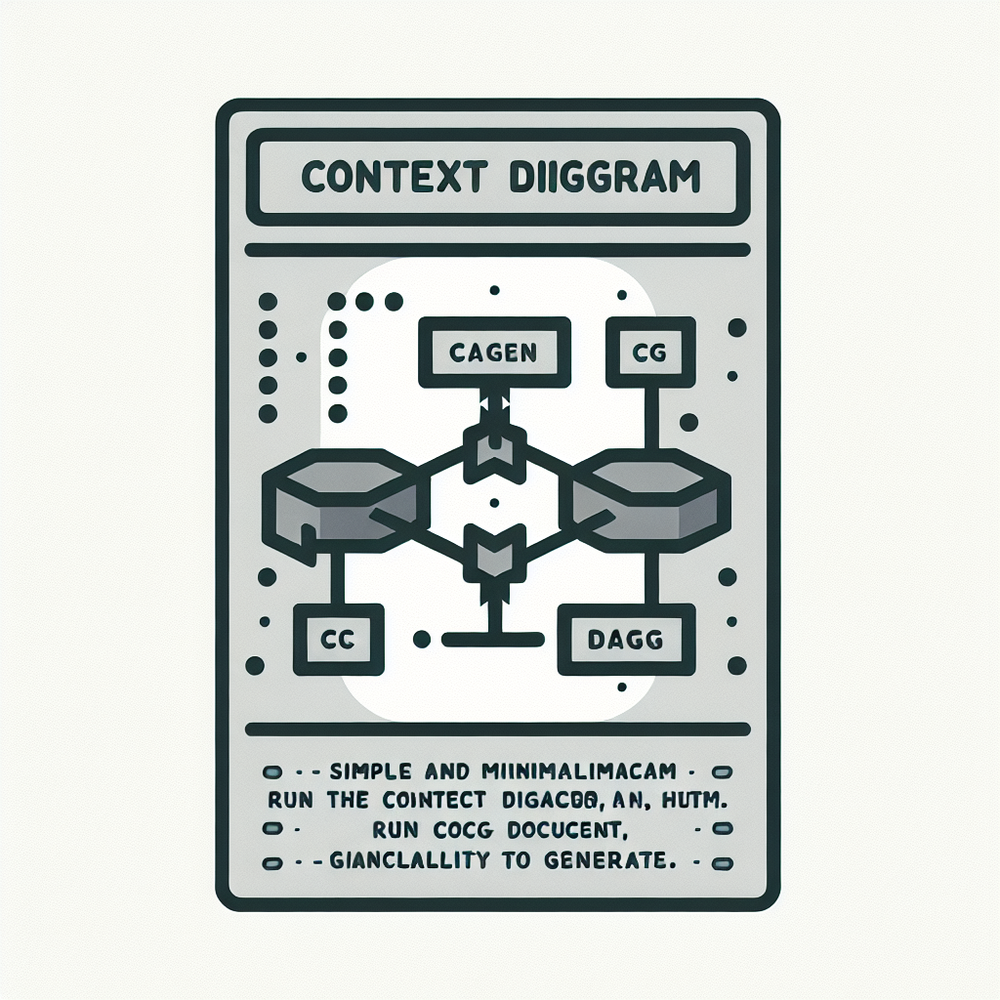
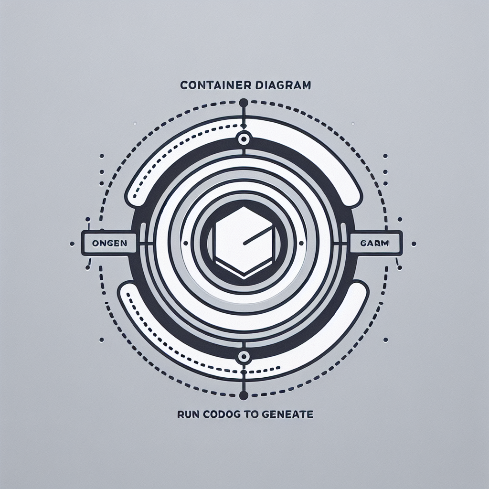

# CC Director - CenCon Documentation Index

**Version:** 1.0.0
**Last Updated:** 2026-02-21
**Schema:** CenCon Method v1.0

---

## Overview

CC Director is a Windows desktop application for managing multiple Claude Code CLI sessions simultaneously. It provides multi-session management, real-time activity tracking, session persistence, embedded console hosting, git integration, and voice mode.

This document serves as the central reference combining product requirements, system architecture, and security profile.

---

## Architecture Diagrams

### Context Diagram (C4 Level 1)



*If diagram is missing, run: `cc_docgen generate`*

### Container Diagram (C4 Level 2)



*If diagram is missing, run: `cc_docgen generate`*

---

## System Components

### WPF UI Layer (CcDirector.Wpf)

| Component | Purpose |
|-----------|---------|
| MainWindow | Primary application window with session sidebar and content area |
| EmbeddedBackend | Native console window overlay using Win32 SetParent |
| EmbeddedConsoleHost | Control for hosting embedded console windows |
| Dialogs | Modal dialogs (NewSession, Rename, Relink, Settings) |
| Voice UI | Voice mode controls and status display |

### Core Services Layer (CcDirector.Core)

| Component | Purpose |
|-----------|---------|
| SessionManager | Session lifecycle management, creation, restoration |
| Session | Central session abstraction with state machine |
| DirectorPipeServer | Named pipe IPC server for hook events |
| EventRouter | Routes pipe messages to appropriate sessions |
| HookInstaller | Manages Claude Code hooks in settings.json |
| GitStatusProvider | Async git status polling |
| ClaudeSessionReader | Session verification via .jsonl matching |
| VoiceModeController | Orchestrates voice interaction flow |
| CircularTerminalBuffer | Thread-safe ring buffer for terminal output |
| FileLog | Thread-safe async file logging |

### Native Windows APIs

| API | Purpose |
|-----|---------|
| CreatePseudoConsole | ConPTY creation for terminal hosting |
| ResizePseudoConsole | Terminal resize handling |
| CreateProcessW | Process spawning with ConPTY attachment |
| SetParent / MoveWindow | Console window embedding |
| NamedPipeServerStream | IPC with hook relay scripts |

---

## Data Flows

### Hook Event Flow

```
Claude Code (claude.exe)
        |
        | stdin JSON (hook fires)
        v
hook-relay.ps1 (PowerShell)
        |
        | Named Pipe Write
        v
\\.\pipe\CC_ClaudeDirector
        |
        | NamedPipeServerStream
        v
DirectorPipeServer
        |
        | Deserialize PipeMessage
        v
EventRouter
        |
        | Map session_id -> Session
        v
Session.HandlePipeEvent()
        |
        | State machine transition
        v
UI Update (INotifyPropertyChanged)
```

### User Input Flow

```
User types in embedded console
        |
        v
conhost.exe
        |
        | stdin to process
        v
claude.exe
        |
        | Hook fires (UserPromptSubmit)
        v
[Hook Event Flow above]
```

---

## Security Profile Summary

**Last Security Review:** See [security_profile.yaml](security_profile.yaml)

### Key Security Controls

- **Process Isolation**: Each Claude session runs in isolated conhost.exe process
- **IPC Boundary**: Named pipes local-only (no network exposure)
- **Credential Handling**: No secrets in source; environment variables only
- **Input Validation**: All paths validated before Process.Start
- **Logging**: Sensitive data truncated; no secrets logged

### Compliance Alignment

| Control | Standard |
|---------|----------|
| CC6.1 | Logical access controls |
| CC6.6 | System boundary protection |
| CC7.2 | Incident response |

See [security_profile.yaml](security_profile.yaml) for full scan rules and drift thresholds.

---

## Related Documentation

| Document | Purpose |
|----------|---------|
| [architecture_manifest.yaml](architecture_manifest.yaml) | Machine-readable C4 model |
| [security_profile.yaml](security_profile.yaml) | Security scan rules and drift config |
| [CC_DOCGEN_SPEC.md](CC_DOCGEN_SPEC.md) | Diagram generator specification |
| [../CodingStyle.md](../CodingStyle.md) | Coding standards |
| [../CODE_REVIEW_GUIDE.md](../CODE_REVIEW_GUIDE.md) | Comprehensive review guide |

---

## Maintenance

### Updating This Documentation

1. After significant architecture changes, update `architecture_manifest.yaml`
2. Run `cc_docgen generate` to regenerate diagrams
3. Update `last_updated` field in manifest
4. After security-relevant changes, update `security_profile.yaml` and set new `last_verified` date

### Drift Detection

The `/review-code` skill checks:
- `architecture_manifest.yaml` must be more recent than code changes
- `security_profile.yaml` must be verified within 30 days

If either check fails, the code review will FAIL and require documentation updates.

---

*Generated for CenCon Method v1.0*
